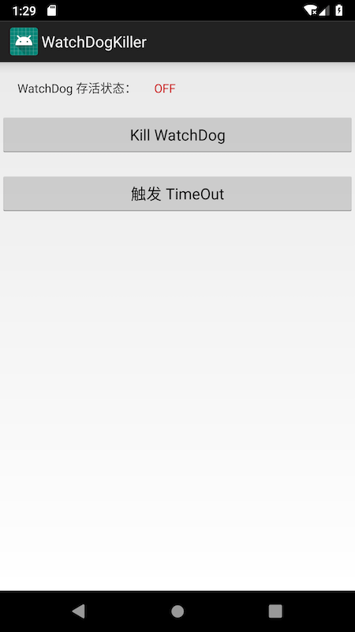

# Chapter02

简介
======
该例子主要演示了如何通过关闭`FinalizerWatchdogDaemon`来减少`TimeoutException`的触发

需要注意的是，此种方法并不是去解决问题，而是为了避免上报异常采取的一种 hack 方案，并没有真正的解决引起 `finialize()` 超时的问题。

界面
======




操作步骤
======

1. 最好在模拟器下执行例子，因为各个手机设置的超时时长不同，不容易观看效果。
2. 点击`触发 Timeout`按钮，等待10多秒后，应用会触发 TimeOut Crash，产生如下日志 


```
D/ghost: =============fire finalize=============FinalizerDaemon
I/.watchdogkille: Thread[3,tid=4369,WaitingInMainSignalCatcherLoop,Thread*=0x76e6ece16400,peer=0x149802d0,"Signal Catcher"]: reacting to signal 3
I/.watchdogkille: Wrote stack traces to '[tombstoned]'
E/AndroidRuntime: FATAL EXCEPTION: FinalizerWatchdogDaemon
    Process: com.dodola.watchdogkiller, PID: 4363
    java.util.concurrent.TimeoutException: com.dodola.watchdogkiller.GhostObject.finalize() timed out after 10 seconds
        at java.lang.Thread.sleep(Native Method)
        at java.lang.Thread.sleep(Thread.java:373)
        at java.lang.Thread.sleep(Thread.java:314)
        at com.dodola.watchdogkiller.GhostObject.finalize(GhostObject.java:13)
        at java.lang.Daemons$FinalizerDaemon.doFinalize(Daemons.java:250)
        at java.lang.Daemons$FinalizerDaemon.runInternal(Daemons.java:237)
        at java.lang.Daemons$Daemon.run(Daemons.java:103)
        at java.lang.Thread.run(Thread.java:764)
I/Process: Sending signal. PID: 4363 SIG: 9

```
3. 点击`Kill WatchDog` 按钮可以关闭 Timeout watchdog，然后点击`触发 TimeOut` 按钮观察情况，正常情况下不会产生 crash

